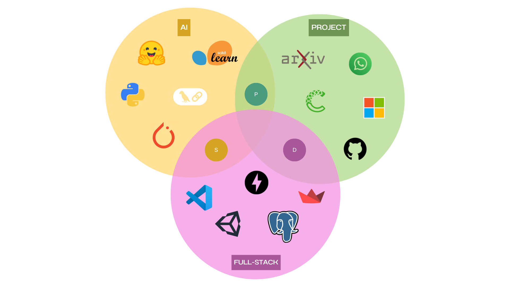

# Clean-up Project

## Overview
This project presents an intelligent, adaptive learning assistant designed to tackle the information overload problem in modern digital education. By integrating emotion detection, personalized content strategies, and ReAct-based AI agents, this system dynamically adapts to learners’ emotional and cognitive states to improve comprehension and retention. The solution leverages a modular architecture and state-of-the-art AI to support modern learning environments with emotionally responsive, personalized pedagogy.

## Main Architecture
- **Emotion Recognition Module:** Custom transformer encoder with attention pooling for real-time affective analysis.
- **Strategy Classifier Module:** Multi-Layer Perceptron (MLP) selects between RAG (Retrieval-Augmented Generation) for novel/complex queries and CAG (Cognitive-Aware Generation) for familiar, emotionally stable content.
- **ReAct Decision Engine:** ReAct (Reason + Act) agent using Mistral-7B and LangChain for interactive, personalized responses.
- **Feedback & Adaptation Loop:** (in development) for future personalization and adaptation.

## Features
- Emotion detection from student queries using transformer models.
- Hybrid content delivery: RAG for knowledge-intensive queries, CAG for fast, cache-based delivery.
- MLP classifier for dynamic strategy selection based on learner state.
- ReAct agent for transparent, adaptive reasoning and response generation.
- Synthetic dataset and curriculum learning for robust, real-world performance.
- Multi-conversation chatbot UI (Streamlit) with PDF export and Unity game integration.
- User authentication (registration, login, 2FA).
- Modular, extensible system design.

## Methodology and Tools
- **Language Models:** Mistral-7B, all-MiniLM-L6-v2
- **Frameworks:** Python, Streamlit, FastAPI, PyTorch, Scikit-learn, Transformers, Sentence-Transformers, LangChain
- **AI/ML Techniques:** Custom MLP, emotion detection, curriculum learning, dual vectorization, attention pooling, focal loss
- **Other Tools:** arXiv, Unity, PDF export, tqdm, matplotlib
- **Infra Tools (planned):** MLflow, batch inference, caching
- **Approach:** Iterative and flexible, adding functionalities on the fly, adapting to feedback and needs



## Use Cases
- AI-powered personal tutoring systems
- Emotion-aware content recommendation in MOOCs
- Cognitive overload mitigation in digital education
- Adaptive learning interfaces for self-paced learners

## Research Objectives
- Detect learner emotions from multimodal inputs.
- Adapt content strategy (RAG vs. CAG) to learner state.
- Use ReAct agents for transparent and adaptive reasoning.
- Provide a feedback-aware loop for future personalization.

## Project Structure
```
├── backend/                # FastAPI backend and database models
├── data/                   # Data files and datasets
├── models/                 # Saved PyTorch models
├── notebooks/              # Jupyter notebooks for experiments/training
├── ui/                     # Streamlit UI and utilities
├── Unity_game/             # Unity WebGL build and assets
├── requirements.txt        # Python dependencies
├── pyproject.toml          # Poetry project file
├── README.md               # Project documentation
```

## Setup Instructions
1. **Clone the project**
   ```sh
   git clone <repo-url>
   cd <repo-folder>
   ```
2. **Checkout the main branch**
   ```sh
   git checkout main
   ```
3. **Download models from the provided link**
   - Download the required models from "link" (replace with actual link).
   - Place the downloaded models in the `models` folder.
4. **Create a conda environment and install Poetry**
   ```sh
   conda create -n action_learning python=3.11 -y
   conda activate action_learning
   pip install poetry
   ```
5. **Install dependencies with Poetry**
   ```sh
   poetry install --no-root
   ```
6. **Set up the PostgreSQL database**
   - Create a database named `action_learning` locally in PostgreSQL (localhost).
   - You can change the database link if needed in the configuration file (see backend/database.py or .env).
   - Add the required table using the following query:
     ```sql
     QUERY
     ```
7. **Run the backend API**
   ```sh
   uvicorn backend.main:app --reload --host 127.0.0.1 --port 8000
   ```
8. **Run the UI**
   ```sh
   cd ./ui
   streamlit run app.py
   ```
9. **Enjoy!**

## Usage
- Access the UI at `http://localhost:8501` after running Streamlit.
- Register or log in to start chatting with the emotion-aware chatbot.
- Export conversations as PDF or play the embedded Unity game.

## Notebooks
- Explore the `notebooks/` directory for Jupyter notebooks on model training, evaluation, and experiments.

## Contributors
- Venkata Purnima PRABHA
- Srishti BINWANI
- David ROSSIG
- **Advisor:** Prof. Alaa Bakhti

## Summary / Comments
Future work could enhance even more: more robust reasoning, better personalization, more flexible architecture, and improved user experience. The project demonstrates the value of combining engineering with human-centered design for educational AI.

You can find our project here: [GitHub](https://github.com/DavidRossig/AL-Emotion)

## References
For a comprehensive list of State Of the Art (SOTA), methodology, and literature review references used in this project, see [REFERENCES.md](./REFERENCES.md).

## Contact
For more information, contact:
- srishti.binwani@epita.fr
- david.rossig@epita.fr
- venkata-purnima.prabha@epita.fr

## Contributing
Pull requests and issues are welcome! Please open an issue to discuss major changes.

## License
This project is licensed to Srishti BINWANI, Venkata Purnima PRABHA, and David ROSSIG. All rights reserved.
